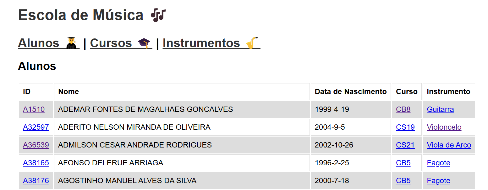

# TPC2: Escola de Música

23/02/2025

## 👤 Autor  

- **Nome:** João Lobo  
- **Número de aluno:** A104356  

## 🎯 Objetivo

Pretende-se construir um serviço em Node.js, que consuma uma API de dados servida por um json-server de uma escola de música e responda com as páginas web do site.

## 📝 Explicação da solução

Para evitar redundâncias e melhorar a organização dos dados, desenvolvi um script em Python que reformata o dataset original antes de ser utilizado pelo json-server. A estrutura de dados resultante normaliza a informação relativa a instrumentos dentro das entidades que a utilizam.

O servidor Node.js foi implementado utilizando o módulo http e a biblioteca axios para comunicação com o json-server. As páginas HTML geradas dinamicamente apresentam a listagem de alunos, cursos, instrumentos e a informação relativa a entradas específicas nestes.

## 🏃‍♂️ Execução

Após ter o json server com o dataset estruturado aberto na porta `3000`, inicia-se o servidor através de:

```
$ npm run start
```

Sendo necessário ter as dependências previamente instaladas:

```
$ npm install
```