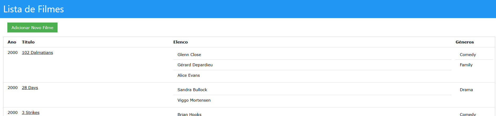

# TPC4: Gestão de Cinema

15/03/2025

## 👤 Autor  

- **Nome:** João Lobo  
- **Número de aluno:** A104356  

## 🎯 Objetivo

Pretende-se construir um serviço em Node.js, que consuma uma API de dados servida por um json-server de um cinema e responda com as páginas web do site usando templates de PUG.

## 📝 Explicação da solução

O servidor Node.js foi implementado utilizando o módulo http e a biblioteca axios para comunicação com o json-server. As páginas HTML são geradas dinamicamente através de templates PUG e permitem todas as operações de CRUD sobre o dataset utilizado.

## 🏃‍♂️ Execução

Após ter o json server com o dataset estruturado aberto na porta `3000`, inicia-se o servidor através de:

```
$ npm run start
```

Sendo necessário ter as dependências previamente instaladas:

```
$ npm install
```