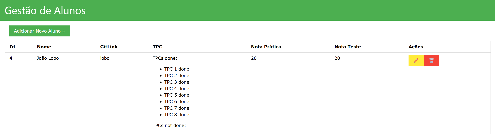

# TPC5: Gestão de Alunos

31/03/2025

## 👤 Autor  

- **Nome:** João Lobo  
- **Número de aluno:** A104356  

## 🎯 Objetivo

Pretende-se construir um serviço em Node.js, que consuma uma API de dados que comunica com uma base de dados em MongoDB.

## 📝 Explicação da solução

O servidor Node.js foi implementado utilizando o módulo http e a biblioteca axios. As páginas HTML são geradas dinamicamente através de templates PUG e permitem todas as operações de CRUD sobre o dataset utilizado.

## 🏃‍♂️ Execução

Após ter a base de dados MongoDB a rodar com o dataset utilizado:

```
$ npm run start
```

Sendo necessário ter as dependências previamente instaladas:

```
$ npm install
```

O serviço encontra-se disponível na porta `3001`.