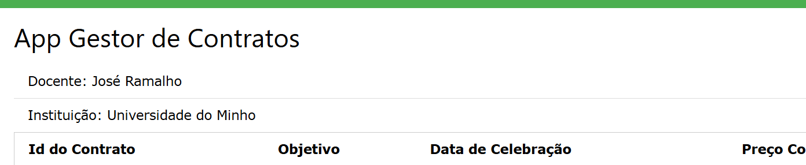

# TPC6: Gestão de Contratos

02/04/2025

## 👤 Autor  

- **Nome:** João Lobo  
- **Número de aluno:** A104356  

## 🎯 Objetivo

O objetivo deste trabalho foi a implementação de uma API de dados baseada num dataset contendo contratos públicos extraídos do Portal da Transparência. A API deveria ser desenvolvida utilizando MongoDB para armazenamento e gestão dos dados, garantindo a persistência das informações. O desafio principal foi estruturar os dados corretamente, permitindo consultas eficientes. Além disso, foi necessário desenvolver um serviço web para exibição dos contratos e entidades associadas, fornecendo funcionalidades como listagem de contratos, detalhamento de uma entidade específica e cálculo do montante total de contratos por entidade.

## 🏃‍♂️ Execução

Após ter a base de dados MongoDB a rodar com o dataset utilizado:

### ⚙️ Backend (API)

```
$ cd backend
```

```
$ npm run start
```

Sendo necessário ter as dependências previamente instaladas:

```
$ npm install
```

O serviço encontra-se disponível na porta `16000`.

### 🖼️ Frontend (UI)

```
$ cd frontend
```

```
$ npm run start
```

Sendo necessário ter as dependências previamente instaladas:

```
$ npm install
```

O serviço encontra-se disponível na porta `16001`.